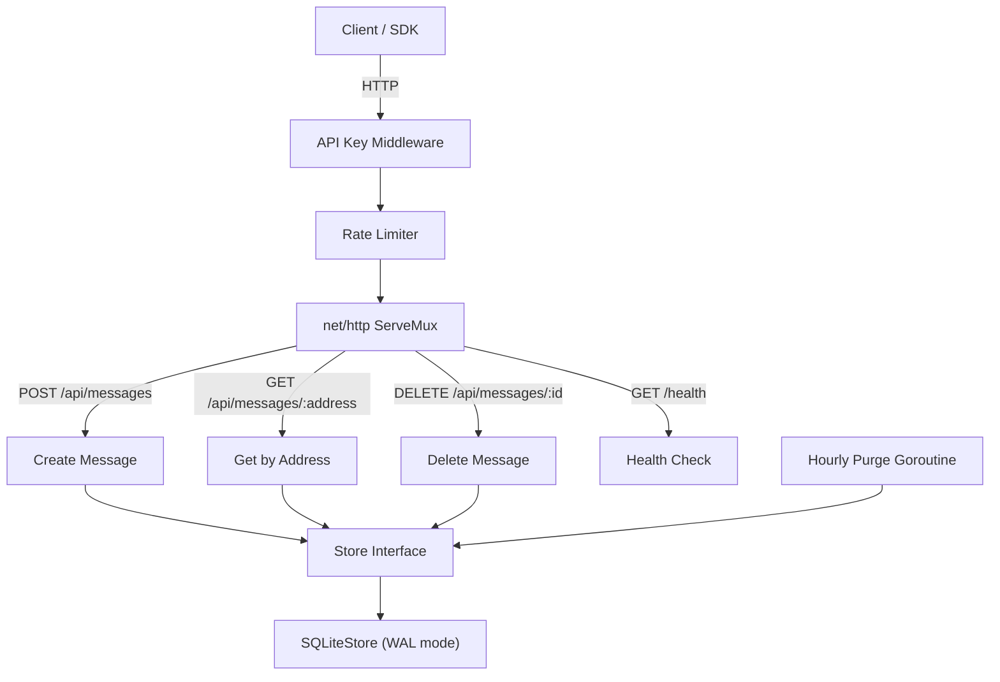

<!-- Don't delete it -->
<div name="readme-top"></div>

<!-- Organization Logo -->
<div align="center" style="display: flex; align-items: center; justify-content: center; gap: 16px;">
  
  
</div>

&nbsp;

<!-- Organization Name -->
<div align="center">

[](https://aossie.org/)

</div>

<!-- Organization/Project Social Handles -->
<p align="center">
<!-- Telegram -->
<a href="https://t.me/StabilityNexus">
</a>
&nbsp;&nbsp;
<!-- X (formerly Twitter) -->
<a href="https://x.com/aossie_org">
</a>
&nbsp;&nbsp;
<!-- Discord -->
<a href="https://discord.gg/hjUhu33uAn">
</a>
&nbsp;&nbsp;
<!-- LinkedIn -->
<a href="https://www.linkedin.com/company/aossie/">
  </a>
&nbsp;&nbsp;
<!-- Youtube -->
<a href="https://www.youtube.com/@AOSSIE-Org">
  </a>
</p>


<p align="center">
  <a href="https://scorecard.dev/viewer/?uri=github.com/AOSSIE-Org/ThruBox-Server">
    
  </a>
  &nbsp;&nbsp;
  <a href="./BestPracticesChecklist.md">
    
  </a>
  &nbsp;&nbsp;
  <a href="https://github.com/gitleaks/gitleaks">
    
  </a>
</p>

---

<div align="center">
<h1>ThruBox Server</h1>
</div>

A simple, self-hostable relay server that acts as a **dumb encrypted mailbox**. Any application can use it to pass encrypted data between users. The server never sees plaintext — all encryption/decryption happens client-side.

---

## 🚀 Features

- **Encrypted Message Relay**: Store and retrieve opaque encrypted payloads via simple REST endpoints
- **Self-Hostable**: Single binary, embedded SQLite, zero external dependencies
- **Configurable TTL**: Auto-purge messages after N days, or set to 0 for permanent storage
- **Rate Limiting**: Built-in IP-based rate limiting to prevent abuse
- **API Key Auth**: Optional API key authentication for private relays
- **Docker Ready**: Dockerfile and Docker Compose included

---

## 💻 Tech Stack

### Backend
- Go 1.22+
- SQLite (embedded, WAL mode) via `mattn/go-sqlite3`
- `net/http` (standard library)

### Infrastructure
- Docker + Docker Compose
- GitHub Actions CI/CD

---

## 🏗️ Architecture Diagram



---

## 🔄 API Endpoints

| Method | Endpoint | Description |
|--------|----------|-------------|
| `POST` | `/api/messages` | Store a new encrypted message |
| `GET` | `/api/messages/:address` | Fetch all messages for a wallet address |
| `DELETE` | `/api/messages/:id` | Delete a specific message |
| `GET` | `/health` | Server health check |

### Send a Message

```bash
curl -X POST http://localhost:3000/api/messages \
  -H "Content-Type: application/json" \
  -d '{"to": "0xRecipient", "from": "0xSender", "payload": "encrypted_base64_data"}'
```

### Fetch Messages

```bash
curl http://localhost:3000/api/messages/0xRecipient
```

### Delete a Message

```bash
curl -X DELETE http://localhost:3000/api/messages/<message-id>
```

---

## 🔗 Repository Links

1. [ThruBox Server](https://github.com/AOSSIE-Org/ThruBox-Server) — This repository (relay server)
2. [ThruBox Client](https://github.com/AOSSIE-Org/ThruBox-Client) — TypeScript SDK

---

## 🍀 Getting Started

### Prerequisites

- Go 1.22+ with CGo enabled (required for SQLite)
- GCC (for compiling go-sqlite3)
- Docker (optional, for containerized deployment)

### Installation

#### 1. Clone the Repository

```bash
git clone https://github.com/AOSSIE-Org/ThruBox-Server.git
cd ThruBox-Server
```

#### 2. Install Dependencies

```bash
go mod download
```

#### 3. Build and Run

```bash
go build -o relay-server ./cmd/relay
./relay-server
```

The server starts on `http://localhost:3000` with a SQLite database that auto-creates at `./data/relay.db`.

#### 4. Docker (Alternative)

```bash
docker compose up -d
```

ThruBox reads `config.yaml` from the working directory. Set `RELAY_CONFIG_PATH`
to load it from anywhere else:

```bash
RELAY_CONFIG_PATH=/etc/relay/config.yaml ./relay-server
```

The image sets this for you and ships the file at `/etc/relay/config.yaml`, so
you can mount your own over it:

```bash
docker run -v ./my-config.yaml:/etc/relay/config.yaml:ro ghcr.io/aossie-org/thrubox-server
```

If no config file is found at the resolved path the server logs a warning at
startup and runs on built-in defaults rather than failing. Precedence is
**built-in defaults → the selected YAML file → environment variables**, so an
environment variable always wins over the file.

#### 5. Run Tests

```bash
go test ./...
```

> Tests live beside the code they cover. See `CONTRIBUTING.md` before submitting a PR that adds functionality without tests.

### Configuration

Edit `config.yaml` or use environment variables:

| Setting | YAML Key | Env Variable | Default |
|---------|----------|-------------|---------|
| Config file path | — | `RELAY_CONFIG_PATH` | `config.yaml` (`/etc/relay/config.yaml` in the Docker image) |
| Server port | `server.port` | `RELAY_SERVER_PORT` | `3000` |
| Server port (fallback) | — | `PORT` | _unset_ — used when `RELAY_SERVER_PORT` is unset **or empty** |
| Server host | `server.host` | `RELAY_SERVER_HOST` | `0.0.0.0` |
| Storage path | `storage.path` | `RELAY_STORAGE_PATH` | `./data/relay.db` |
| Message TTL | `messages.ttl_days` | `RELAY_MESSAGES_TTL_DAYS` | `7` (0 = forever) |
| Max payload | `messages.max_payload_size` | `RELAY_MESSAGES_MAX_PAYLOAD_SIZE` | `524288` (500KB) |
| Rate limit | `security.rate_limit` | `RELAY_SECURITY_RATE_LIMIT` | `30` req/min/IP |
| API key | `security.api_key` | `RELAY_SECURITY_API_KEY` | `` (disabled) |
| CORS origins | `security.allowed_origins` | `RELAY_SECURITY_ALLOWED_ORIGINS` | `` (CORS disabled) |

### CORS

By default the relay serves **no CORS headers**, so a browser calling it from
another origin is blocked at the preflight. There are two ways to run a
browser client:

**1. Reverse proxy (no relay configuration).** Put the relay behind a
same-origin path in your own app — a Vercel rewrite, an nginx `location`, a
Vite `server.proxy` entry. The request is never cross-origin, so CORS never
applies. This is the setup the ThruBox client docs assume.

**2. Direct calls with an origin allowlist.** List the origins you want to
serve and browsers can call the relay directly, no proxy needed:

```yaml
security:
  allowed_origins:
    - "https://app.example.com"
    - "http://localhost:5173"
```

or via the environment, comma-separated:

```bash
RELAY_SECURITY_ALLOWED_ORIGINS="https://app.example.com,http://localhost:5173"
```

When an origin is allowed, the relay answers preflights and returns
`Access-Control-Allow-Origin` for that origin, `Access-Control-Allow-Methods:
GET, POST, DELETE, OPTIONS`, and `Access-Control-Allow-Headers: Content-Type`
— plus `X-API-Key` when `security.api_key` is set.

Notes:

- Entries must be full origins (`https://host[:port]`), with no path. A bare
  hostname or a URL with a path is rejected at startup rather than silently
  never matching.
- `"*"` allows any origin. It cannot be combined with specific origins, and it
  is a poor fit for a relay with no API key configured — anything on the web
  can then read and write messages from a browser.
- Credentialed CORS is not supported. The relay authenticates with the
  `X-API-Key` header, not cookies, so `Access-Control-Allow-Credentials` is
  never sent.
- An allowlisted origin still has to satisfy `security.api_key` and the rate
  limiter. CORS controls which origins a browser will let read a response; it
  is not authentication.

> **Deploying to a managed platform?** Render, Railway, Heroku and Cloud Run
> inject a `PORT` variable and expect the process to bind to it. ThruBox reads
> it automatically, so no extra configuration is needed. `RELAY_SERVER_PORT`
> still takes precedence whenever it is set to a non-empty value, so setting it
> to `""` (as an empty `docker-compose` entry does) falls through to `PORT`.

---

## 🙌 Contributing

⭐ Don't forget to star this repository if you find it useful! ⭐

Thank you for considering contributing to this project! Contributions are highly appreciated and welcomed. To ensure smooth collaboration, please refer to our [Contribution Guidelines](./CONTRIBUTING.md).

---

## ✨ Maintainers

See [MAINTAINERS.md](./MAINTAINERS.md) for the full list of Mentors and Maintainers for this repository.

---

## 📍 License

This project is licensed under the GNU General Public License v3.0.
See the [LICENSE](LICENSE) file for details.

---

## 💪 Thanks To All Contributors

Thanks a lot for spending your time helping ThruBox grow. Keep rocking 🥂

[](https://github.com/AOSSIE-Org/ThruBox-Server/graphs/contributors)

© 2025 AOSSIE
