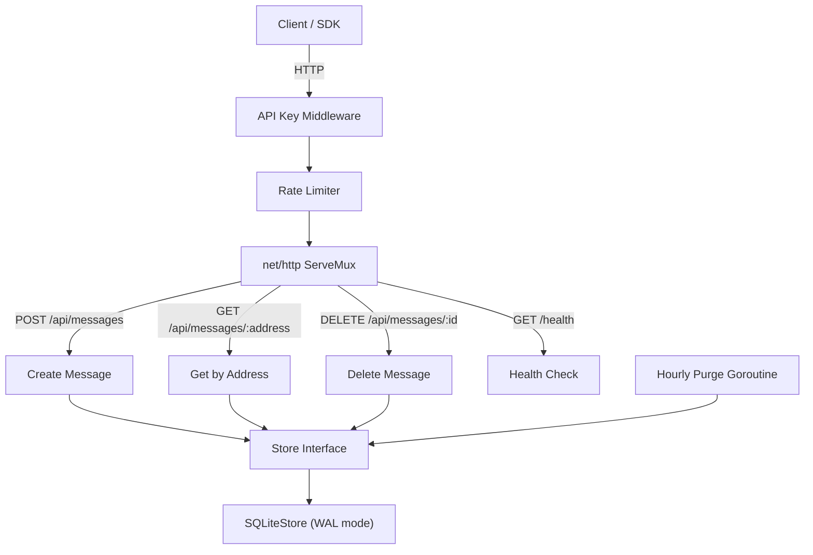

<!-- Don't delete it -->
<div name="readme-top"></div>

<!-- Organization Logo -->
<div align="center" style="display: flex; align-items: center; justify-content: center; gap: 16px;">
  
  
</div>

&nbsp;

<!-- Organization Name -->
<div align="center">

[](https://aossie.org/)

</div>

<!-- Organization/Project Social Handles -->
<p align="center">
<!-- Telegram -->
<a href="https://t.me/StabilityNexus">
</a>
&nbsp;&nbsp;
<!-- X (formerly Twitter) -->
<a href="https://x.com/aossie_org">
</a>
&nbsp;&nbsp;
<!-- Discord -->
<a href="https://discord.gg/hjUhu33uAn">
</a>
&nbsp;&nbsp;
<!-- LinkedIn -->
<a href="https://www.linkedin.com/company/aossie/">
  </a>
&nbsp;&nbsp;
<!-- Youtube -->
<a href="https://www.youtube.com/@AOSSIE-Org">
  </a>
</p>


<p align="center">
  <a href="https://scorecard.dev/viewer/?uri=github.com/AOSSIE-Org/ThruBox-Server">
    
  </a>
  &nbsp;&nbsp;
  <a href="./BestPracticesChecklist.md">
    
  </a>
  &nbsp;&nbsp;
  <a href="https://github.com/gitleaks/gitleaks">
    
  </a>
</p>

---

<div align="center">
<h1>ThruBox Server</h1>
</div>

A simple, self-hostable relay server that acts as a **dumb encrypted mailbox**. Any application can use it to pass encrypted data between users. The server never sees plaintext — all encryption/decryption happens client-side.

---

## 🚀 Features

- **Encrypted Message Relay**: Store and retrieve opaque encrypted payloads via simple REST endpoints
- **Self-Hostable**: Single binary, embedded SQLite, zero external dependencies
- **Configurable TTL**: Auto-purge messages after N days, or set to 0 for permanent storage
- **Rate Limiting**: Built-in IP-based rate limiting to prevent abuse
- **API Key Auth**: Optional API key authentication for private relays
- **Docker Ready**: Dockerfile and Docker Compose included

---

## 💻 Tech Stack

### Backend
- Go 1.22+
- SQLite (embedded, WAL mode) via `mattn/go-sqlite3`
- `net/http` (standard library)

### Infrastructure
- Docker + Docker Compose
- GitHub Actions CI/CD

---

## 🏗️ Architecture Diagram



---

## 🔄 API Endpoints

| Method | Endpoint | Description |
|--------|----------|-------------|
| `POST` | `/api/messages` | Store a new encrypted message |
| `GET` | `/api/messages/:address` | Fetch all messages for a wallet address |
| `DELETE` | `/api/messages/:id` | Delete a specific message |
| `GET` | `/health` | Server health check |

### Send a Message

```bash
curl -X POST http://localhost:3000/api/messages \
  -H "Content-Type: application/json" \
  -d '{"to": "0xRecipient", "from": "0xSender", "payload": "encrypted_base64_data"}'
```

### Fetch Messages

```bash
curl http://localhost:3000/api/messages/0xRecipient
```

### Delete a Message

```bash
curl -X DELETE http://localhost:3000/api/messages/<message-id>
```

---

## 🔗 Repository Links

1. [ThruBox Server](https://github.com/AOSSIE-Org/ThruBox-Server) — This repository (relay server)
2. [ThruBox Client](https://github.com/AOSSIE-Org/ThruBox-Client) — TypeScript SDK

---

## 🍀 Getting Started

### Prerequisites

- Go 1.22+ with CGo enabled (required for SQLite)
- GCC (for compiling go-sqlite3)
- Docker (optional, for containerized deployment)

### Installation

#### 1. Clone the Repository

```bash
git clone https://github.com/AOSSIE-Org/ThruBox-Server.git
cd ThruBox-Server
```

#### 2. Install Dependencies

```bash
go mod download
```

#### 3. Build and Run

```bash
go build -o relay-server ./cmd/relay
./relay-server
```

The server starts on `http://localhost:3000` with a SQLite database that auto-creates at `./data/relay.db`.

#### 4. Docker (Alternative)

```bash
docker compose up -d
```

ThruBox reads `config.yaml` from the working directory. Set `RELAY_CONFIG_PATH`
to load it from anywhere else:

```bash
RELAY_CONFIG_PATH=/etc/relay/config.yaml ./relay-server
```

The image sets this for you and ships the file at `/etc/relay/config.yaml`, so
you can mount your own over it:

```bash
docker run -v ./my-config.yaml:/etc/relay/config.yaml:ro ghcr.io/aossie-org/thrubox-server
```

If no config file is found at the resolved path the server logs a warning at
startup and runs on built-in defaults rather than failing. Precedence is
**built-in defaults → the selected YAML file → environment variables**, so an
environment variable always wins over the file.

> **Exposing to the internet?** See [Exposing to the Internet (Self-Hosting)](#exposing-to-the-internet) for complete step-by-step guides using Nginx reverse proxy or Cloudflare Tunnel.

#### 5. Run Tests

```bash
go test ./...
```

> Tests live beside the code they cover. See `CONTRIBUTING.md` before submitting a PR that adds functionality without tests.

### Configuration

Edit `config.yaml` or use environment variables:

| Setting | YAML Key | Env Variable | Default |
|---------|----------|-------------|---------|
| Config file path | — | `RELAY_CONFIG_PATH` | `config.yaml` (`/etc/relay/config.yaml` in the Docker image) |
| Server port | `server.port` | `RELAY_SERVER_PORT` | `3000` |
| Server port (fallback) | — | `PORT` | _unset_ — used when `RELAY_SERVER_PORT` is unset **or empty** |
| Server host | `server.host` | `RELAY_SERVER_HOST` | `0.0.0.0` |
| Storage path | `storage.path` | `RELAY_STORAGE_PATH` | `./data/relay.db` |
| Message TTL | `messages.ttl_days` | `RELAY_MESSAGES_TTL_DAYS` | `7` (0 = forever) |
| Max payload | `messages.max_payload_size` | `RELAY_MESSAGES_MAX_PAYLOAD_SIZE` | `524288` (500KB) |
| Rate limit | `security.rate_limit` | `RELAY_SECURITY_RATE_LIMIT` | `30` req/min/IP |
| API key | `security.api_key` | `RELAY_SECURITY_API_KEY` | `` (disabled) |
| CORS origins | `security.allowed_origins` | `RELAY_SECURITY_ALLOWED_ORIGINS` | `` (CORS disabled) |

### CORS

By default the relay serves **no CORS headers**, so a browser calling it from
another origin is blocked at the preflight. There are two ways to run a
browser client:

**1. Reverse proxy (no relay configuration).** Put the relay behind a
same-origin path in your own app — a Vercel rewrite, an nginx `location`, a
Vite `server.proxy` entry. The request is never cross-origin, so CORS never
applies. This is the setup the ThruBox client docs assume (see [Option 1: Nginx Reverse Proxy](#nginx-reverse-proxy)).

**2. Direct calls with an origin allowlist.** List the origins you want to
serve and browsers can call the relay directly, no proxy needed:

```yaml
security:
  allowed_origins:
    - "https://app.example.com"
    - "http://localhost:5173"
```

or via the environment, comma-separated:

```bash
RELAY_SECURITY_ALLOWED_ORIGINS="https://app.example.com,http://localhost:5173"
```

When an origin is allowed, the relay answers preflights and returns
`Access-Control-Allow-Origin` for that origin, `Access-Control-Allow-Methods:
GET, POST, DELETE, OPTIONS`, and `Access-Control-Allow-Headers: Content-Type`
— plus `X-API-Key` when `security.api_key` is set.

Notes:

- Entries must be full origins (`https://host[:port]`), with no path. A bare
  hostname or a URL with a path is rejected at startup rather than silently
  never matching.
- `"*"` allows any origin. It cannot be combined with specific origins, and it
  is a poor fit for a relay with no API key configured — anything on the web
  can then read and write messages from a browser.
- Credentialed CORS is not supported. The relay authenticates with the
  `X-API-Key` header, not cookies, so `Access-Control-Allow-Credentials` is
  never sent.
- An allowlisted origin still has to satisfy `security.api_key` and the rate
  limiter. CORS controls which origins a browser will let read a response; it
  is not authentication.

> **Deploying to a managed platform?** Render, Railway, Heroku and Cloud Run
> inject a `PORT` variable and expect the process to bind to it. ThruBox reads
> it automatically, so no extra configuration is needed. `RELAY_SERVER_PORT`
> still takes precedence whenever it is set to a non-empty value, so setting it
> to `""` (as an empty `docker-compose` entry does) falls through to `PORT`.

---

<div name="exposing-to-the-internet" id="exposing-to-the-internet"></div>

## 🌐 Exposing to the Internet (Self-Hosting)

When self-hosting ThruBox Server with Docker, the container runs locally and listens on port `3000` by default. To make your relay accessible to clients and client SDKs over the public internet, you should place it behind either a **reverse proxy** or a **secure tunnel**.

```text
Internet Requests (HTTPS)
           │
           ▼
┌──────────────────────────────────────┐
│  Option 1: Nginx Reverse Proxy       │  (Public IP, ports 80/443, Certbot SSL)
│                 OR                   │
│  Option 2: Cloudflare Tunnel         │  (No open inbound ports, outbound tunnel)
└──────────────────┬───────────────────┘
                   │  HTTP (localhost:3000)
                   ▼
┌──────────────────────────────────────┐
│    Local ThruBox Server (Docker)     │  (Container listening on port 3000)
└──────────────────────────────────────┘
```

> [!IMPORTANT]
> **Security Recommendation**: Never expose the raw ThruBox container port (`3000`) directly to the public internet (`0.0.0.0:3000`). Bind the port strictly to `127.0.0.1:3000:3000` on your host so only local services (such as Nginx or `cloudflared`) can communicate with it.

---

### Step 0: Run ThruBox Server Locally on Docker

1. In your `docker-compose.yml`, restrict the port binding to `127.0.0.1`:

   ```yaml
   services:
     relay:
       build: .
       ports:
         - "127.0.0.1:3000:3000"
       volumes:
         - relay-data:/data
       environment:
         - RELAY_STORAGE_PATH=/data/relay.db
       restart: unless-stopped

   volumes:
     relay-data:
   ```

   Or run the container using `docker run`:

   ```bash
   docker run -d \
     --name thrubox-relay \
     -p 127.0.0.1:3000:3000 \
     -v relay-data:/data \
     ghcr.io/aossie-org/thrubox-server:latest
   ```

2. Confirm the server is running and healthy on `localhost:3000`:

   ```bash
   curl http://127.0.0.1:3000/health
   ```

   Expected response:

   ```json
   {"status":"ok"}
   ```

Choose one of the two deployment methods below:

- **[Option 1: Nginx Reverse Proxy](#nginx-reverse-proxy)**: Best if you have a public IP address and can open/forward inbound ports `80` and `443`.
- **[Option 2: Cloudflare Tunnel](#cloudflare-tunnel)**: Best if you are behind CGNAT, on a home network, or cannot/prefer not to open inbound router ports.

---

<div name="nginx-reverse-proxy" id="nginx-reverse-proxy"></div>

### Option 1: Nginx Reverse Proxy

Nginx acts as a front-facing web server that accepts HTTPS connections from the internet, handles TLS encryption/decryption, and forwards requests to the local ThruBox container on `http://127.0.0.1:3000`.

#### Prerequisites for Nginx

- A Linux server with Docker and ThruBox Server running locally on `http://127.0.0.1:3000`.
- A registered domain or subdomain (e.g., `relay.example.com`) with a DNS `A` or `AAAA` record pointing to your server's public IP address.
- Inbound ports `80` (HTTP) and `443` (HTTPS) open on your firewall and forwarded on your router (if hosting from a local/home network).

#### 1. Install Nginx

```bash
# Debian / Ubuntu
sudo apt update && sudo apt install -y nginx

# RHEL / Fedora / AlmaLinux
sudo dnf install -y nginx
```

Enable and start Nginx:

```bash
sudo systemctl enable --now nginx
```

#### 2. Create Nginx Configuration

Create a new configuration file for ThruBox:

- **Debian / Ubuntu**: `/etc/nginx/sites-available/thrubox.conf`
- **RHEL / Fedora**: `/etc/nginx/conf.d/thrubox.conf`

```nginx
server {
    listen 80;
    listen [::]:80;

    # Replace with your actual domain or subdomain
    server_name relay.example.com;

    # Allow request payloads matching or exceeding ThruBox max_payload_size (default: 500KB)
    client_max_body_size 10M;

    location / {
        proxy_pass http://127.0.0.1:3000;
        proxy_http_version 1.1;

        # Forward request metadata for logging and accurate rate limiting
        proxy_set_header Host $host;
        proxy_set_header X-Real-IP $remote_addr;
        proxy_set_header X-Forwarded-For $proxy_add_x_forwarded_for;
        proxy_set_header X-Forwarded-Proto $scheme;

        # Proxy timeouts matching ThruBox server timeouts
        proxy_connect_timeout 60s;
        proxy_send_timeout 60s;
        proxy_read_timeout 60s;
    }
}
```

**Key Configuration Directives Explained**:

- `server_name relay.example.com;`: Tells Nginx which domain name this server block handles. Replace `relay.example.com` with your actual domain or subdomain.
- `client_max_body_size 10M;`: Sets the maximum allowed HTTP request body size. Nginx's default is `1M`. Since ThruBox accepts encrypted payloads up to `messages.max_payload_size` (default: 500KB, configurable), setting this prevents Nginx from rejecting valid large payloads with `413 Request Entity Too Large`.
- `proxy_pass http://127.0.0.1:3000;`: Proxies incoming requests to the ThruBox Docker container listening on port 3000.
- `proxy_set_header X-Real-IP` and `X-Forwarded-For`: Passes the real client IP address. ThruBox's built-in rate limiter inspects these headers so rate limits apply per client IP rather than to `127.0.0.1`.
- `proxy_set_header Host` and `X-Forwarded-Proto`: Preserves the original requested host and protocol (HTTP vs HTTPS).

#### 3. Enable and Test Configuration

On Debian / Ubuntu, enable the site by linking it into `sites-enabled`:

```bash
sudo ln -s /etc/nginx/sites-available/thrubox.conf /etc/nginx/sites-enabled/
```

Test the configuration for syntax errors:

```bash
sudo nginx -t
```

Reload Nginx to apply changes:

```bash
sudo systemctl reload nginx
```

#### 4. Configure HTTPS / SSL with Let's Encrypt (Certbot)

Securing relay traffic with TLS is critical to ensure that opaque encrypted payloads and metadata are transmitted securely over HTTPS:

1. Install Certbot and its Nginx plugin:

   ```bash
   # Debian / Ubuntu
   sudo apt install -y certbot python3-certbot-nginx

   # RHEL / Fedora / AlmaLinux
   sudo dnf install -y certbot python3-certbot-nginx
   ```

2. Obtain and automatically install the SSL certificate:

   ```bash
   sudo certbot --nginx -d relay.example.com
   ```

   Certbot will verify your domain, obtain the certificate, update your Nginx configuration with SSL directives, and set up automatic HTTP-to-HTTPS redirection.

3. Verify automatic renewal:

   ```bash
   sudo certbot renew --dry-run
   ```

#### 5. Verify the Deployment

Test that your server is reachable over the internet:

```bash
curl -i https://relay.example.com/health
```

Expected response:

```http
HTTP/2 200
content-type: application/json

{"status":"ok"}
```

#### Troubleshooting Nginx

- **`502 Bad Gateway`**: Nginx cannot reach the backend. Check if the ThruBox container is running (`docker ps`) and responds locally (`curl http://127.0.0.1:3000/health`). If using RHEL/Fedora/CentOS with SELinux, run `sudo setsebool -P httpd_can_network_connect 1` to allow Nginx to connect to network sockets.
- **`413 Request Entity Too Large`**: The uploaded message payload exceeds Nginx's `client_max_body_size`. Increase `client_max_body_size` in your server block and reload Nginx.
- **Connection Timed Out / Unreachable**: Verify that ports `80` and `443` are allowed by your firewall (`sudo ufw allow 80/tcp && sudo ufw allow 443/tcp` on Ubuntu, or `sudo firewall-cmd --permanent --add-service=http --add-service=https && sudo firewall-cmd --reload` on RHEL/Fedora).
- **Configuration Syntax Errors**: Run `sudo nginx -t` to pinpoint syntax issues. Check `/var/log/nginx/error.log` for runtime errors.

---

<div name="cloudflare-tunnel" id="cloudflare-tunnel"></div>

### Option 2: Cloudflare Tunnel (`cloudflared`)

[Cloudflare Tunnel](https://developers.cloudflare.com/cloudflare-one/connections/connect-networks/) creates an outbound-only connection between your local environment and Cloudflare's global edge network.

**Why use Cloudflare Tunnel?**:

- **Zero open inbound ports**: You do not need to open ports `80` or `443` on your firewall or router.
- **Works behind CGNAT & Dynamic IPs**: Ideal for home networks, residential ISPs, or cloud VPS instances without a static public IP.
- **Automatic SSL & DDoS Protection**: Edge SSL certificates and DDoS mitigation are managed automatically by Cloudflare.

#### Prerequisites for Cloudflare Tunnel

- A free [Cloudflare account](https://dash.cloudflare.com/).
- A domain managed by Cloudflare (nameservers pointed to Cloudflare).
- ThruBox Server running locally on `http://localhost:3000`.

You can configure Cloudflare Tunnel either via the **`cloudflared` CLI on the host** or using **Docker Compose**.

#### Method A: Host CLI Setup

##### 1. Install `cloudflared`

Install `cloudflared` following the [official installation documentation](https://developers.cloudflare.com/cloudflare-one/connections/connect-networks/downloads/):

```bash
# Debian / Ubuntu (x86_64)
curl -L --output cloudflared.deb https://github.com/cloudflare/cloudflared/releases/latest/download/cloudflared-linux-amd64.deb
sudo dpkg -i cloudflared.deb

# macOS (Homebrew)
brew install cloudflared

# Windows (winget)
winget install --id Cloudflare.cloudflared
```

##### 2. Authenticate `cloudflared`

```bash
cloudflared tunnel login
```

This command outputs an authentication link. Open it in your browser, log in to Cloudflare, and authorize your domain zone. The command will download a certificate to `~/.cloudflared/cert.pem`.

##### 3. Create a Tunnel

```bash
cloudflared tunnel create thrubox-tunnel
```

This outputs a **Tunnel ID** (a UUID like `a1b2c3d4-e5f6-7890-abcd-ef1234567890`) and creates the credentials file at `~/.cloudflared/<TUNNEL_ID>.json`.

##### 4. Create the Configuration File

Create `~/.cloudflared/config.yml` (replace `<TUNNEL_ID>`, `<YOUR_USERNAME>`, and `relay.example.com` with your actual values):

```yaml
tunnel: <TUNNEL_ID>
credentials-file: /home/<YOUR_USERNAME>/.cloudflared/<TUNNEL_ID>.json

ingress:
  - hostname: relay.example.com
    service: http://localhost:3000
  - service: http_status:404
```

##### 5. Route DNS to the Tunnel

Associate your domain or subdomain with the tunnel:

```bash
cloudflared tunnel route dns thrubox-tunnel relay.example.com
```

This automatically creates a CNAME DNS record in Cloudflare pointing `relay.example.com` to your tunnel.

##### 6. Test and Run the Tunnel

Run the tunnel in your console to verify connectivity:

```bash
cloudflared tunnel run thrubox-tunnel
```

Test access by sending a request in a separate terminal:

```bash
curl https://relay.example.com/health
```

Once verified, stop the foreground process with `Ctrl+C`.

##### 7. Install as a Persistent Background Service

Install `cloudflared` as a system service so it automatically runs on boot:

```bash
sudo cloudflared --config /home/<YOUR_USERNAME>/.cloudflared/config.yml service install
sudo systemctl enable --now cloudflared
```

---

#### Method B: Containerized Setup (Docker Compose)

If you prefer a completely containerized deployment without installing packages on the host system:

1. Go to the [Cloudflare Zero Trust Dashboard](https://one.dash.cloudflare.com/) > **Networks** > **Tunnels** > **Create a tunnel**.
2. Name your tunnel (e.g. `thrubox`) and select **Cloudflared**.
3. In the setup instructions, copy the tunnel token from the Docker command (`--token <YOUR_TUNNEL_TOKEN>`).
4. In the **Public Hostname** tab, configure:
   - **Subdomain / Domain**: e.g., `relay.example.com`
   - **Service Type**: `HTTP`
   - **URL**: `relay:3000` (this uses Docker's internal container networking)
5. Update your `docker-compose.yml`:

   ```yaml
   services:
     relay:
       build: .
       volumes:
         - relay-data:/data
       environment:
         - RELAY_STORAGE_PATH=/data/relay.db
       restart: unless-stopped

     cloudflared:
       image: cloudflare/cloudflared:latest
       restart: unless-stopped
       command: tunnel --no-autoupdate run --token ${CLOUDFLARE_TUNNEL_TOKEN}
       depends_on:
         - relay

   volumes:
     relay-data:
   ```

6. Set your token in a `.env` file in the same directory:

   ```bash
   CLOUDFLARE_TUNNEL_TOKEN=eyJh...your_cloudflare_token_here...
   ```

7. Start your services:

   ```bash
   docker compose up -d
   ```

   In this setup, `cloudflared` communicates directly with `relay:3000` over the private Docker bridge network. The ThruBox port does not even need to be mapped to the host!

#### Troubleshooting Cloudflare Tunnel

- **`Error 1033 (Argo Tunnel error)`**: `cloudflared` is running, but cannot establish a connection to `http://localhost:3000` (or `http://relay:3000`). Confirm that the ThruBox container is running and healthy.
- **SSL/TLS Redirect Loops**: In the Cloudflare dashboard under **SSL/TLS**, set your encryption mode to **Full** (or **Flexible** if proxying to HTTP). Avoid "Off".
- **DNS Record Issues**: Check the **DNS** records in your Cloudflare dashboard to ensure the CNAME for `relay.example.com` points to `<TUNNEL_ID>.cfargotunnel.com` with proxy enabled (orange cloud).
- **Inspect Service Logs**:
  - Host service: `sudo journalctl -u cloudflared -f`
  - Docker container: `docker logs -f cloudflared`

---

### 🔒 Post-Deployment Security Checklist

Once your ThruBox Server is exposed to the internet:

1. **Protect Private Relays with an API Key**:
   If your server is intended for private use, enable API key authentication by setting `security.api_key` in `config.yaml` or through the environment variable:

   ```bash
   RELAY_SECURITY_API_KEY="your-secret-api-key"
   ```

   Clients will be required to send this value in the `X-API-Key` HTTP header.

2. **Verify Rate Limiting**:
   ThruBox has built-in IP rate limiting (default: 30 requests/minute/IP). Because both Nginx and Cloudflare pass the client's original IP in the `X-Real-IP` and `X-Forwarded-For` headers, ThruBox correctly applies rate limits per client rather than to the proxy itself. You can adjust the limit via `security.rate_limit` or `RELAY_SECURITY_RATE_LIMIT`.

3. **Configure CORS If Calling Directly from Browsers**:
   If web applications hosted on other domains will call your relay directly, configure `security.allowed_origins` in `config.yaml` or set `RELAY_SECURITY_ALLOWED_ORIGINS` (see [CORS](#cors)). If you serve your frontend and relay under the same domain using reverse proxy path routing, CORS configuration is not needed.

---

## 🙌 Contributing

⭐ Don't forget to star this repository if you find it useful! ⭐

Thank you for considering contributing to this project! Contributions are highly appreciated and welcomed. To ensure smooth collaboration, please refer to our [Contribution Guidelines](./CONTRIBUTING.md).

---

## ✨ Maintainers

See [MAINTAINERS.md](./MAINTAINERS.md) for the full list of Mentors and Maintainers for this repository.

---

## 📍 License

This project is licensed under the GNU General Public License v3.0.
See the [LICENSE](LICENSE) file for details.

---

## 💪 Thanks To All Contributors

Thanks a lot for spending your time helping ThruBox grow. Keep rocking 🥂

[](https://github.com/AOSSIE-Org/ThruBox-Server/graphs/contributors)

© 2025 AOSSIE
